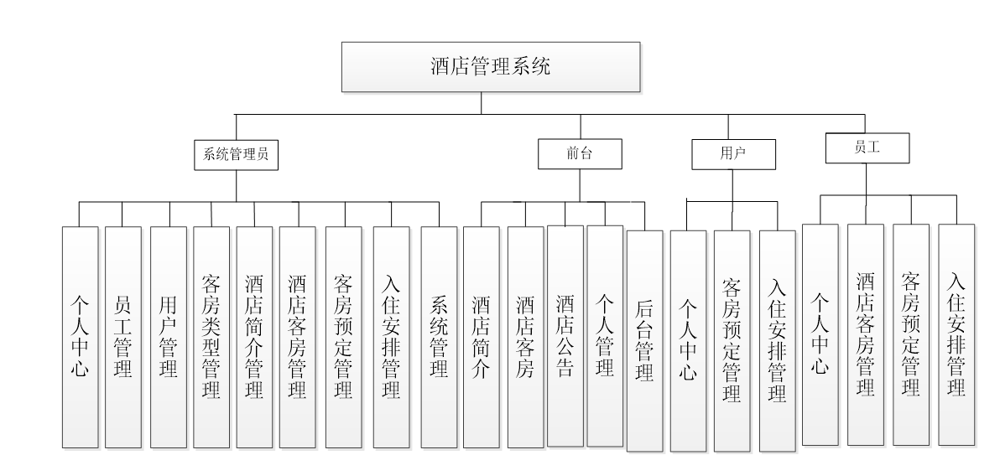
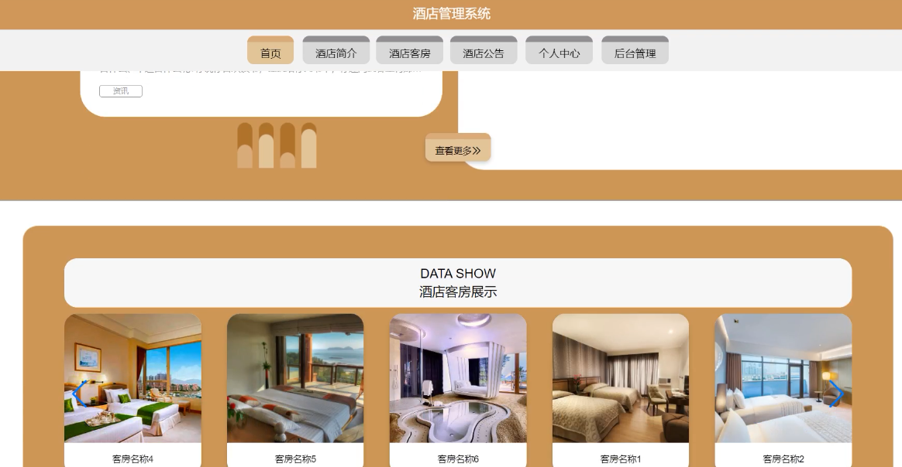
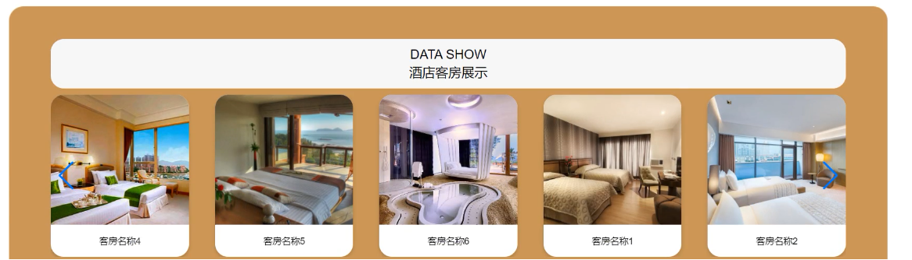
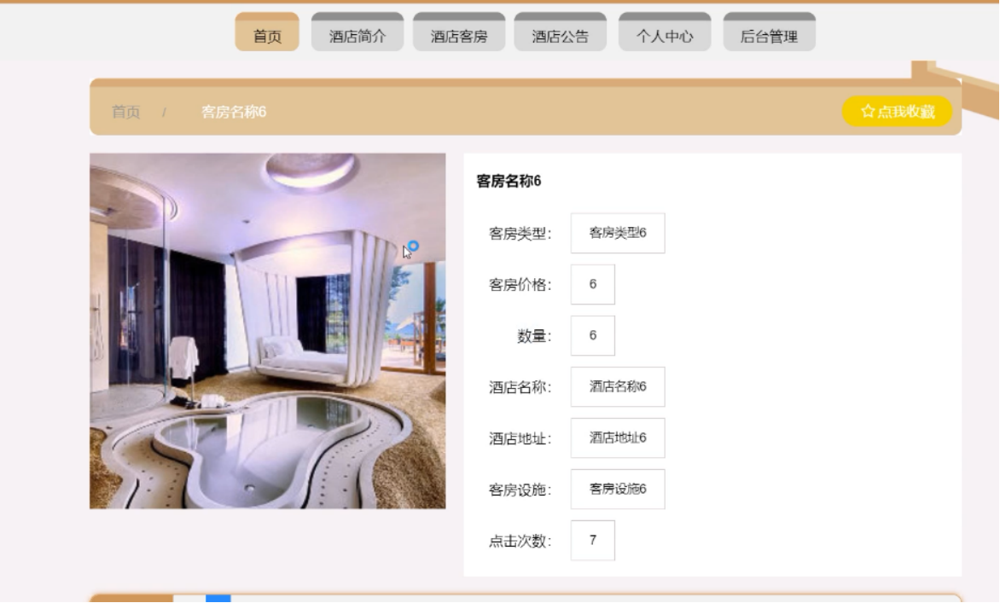
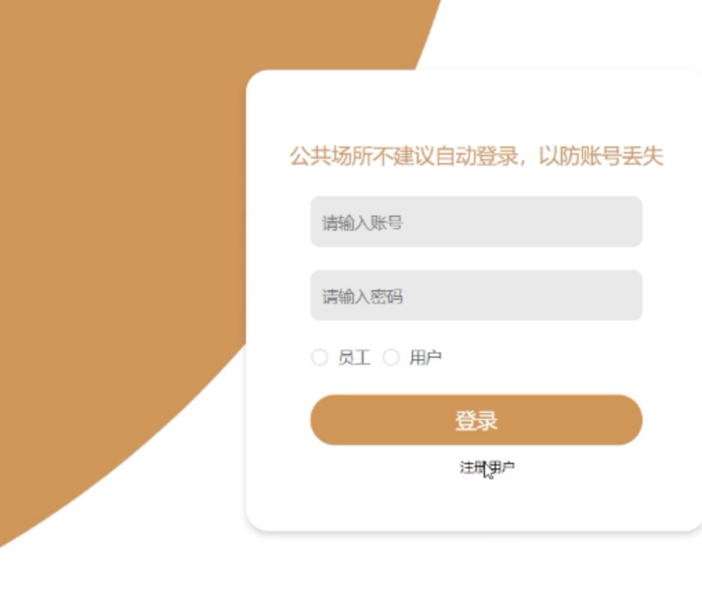
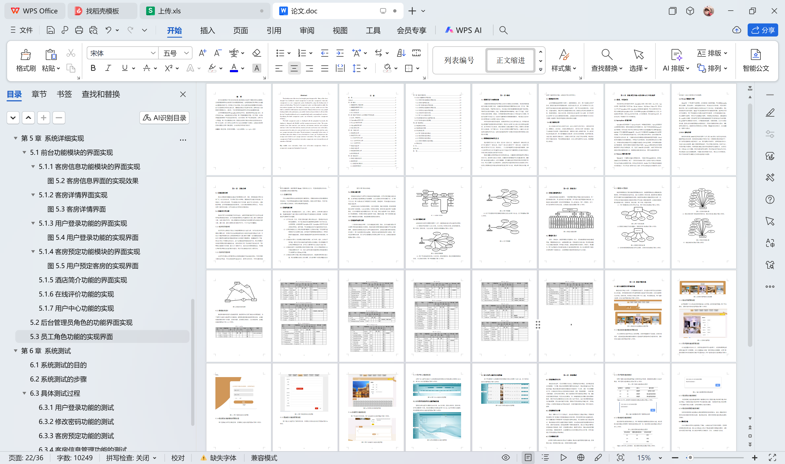

# springboot123-基于SpringBoot的酒店管理系统

>  博主介绍：
>  Hey，我是程序员Chaers，一个专注于计算机领域的程序员
>  十年大厂程序员全栈开发‍ 日常分享项目经验 解决技术难题与技术推荐 承接各类网站设计，小程序开发，毕设等。
>  【计算机专业课程设计，毕业设计项目，Java，微信小程序，安卓APP都可以做，不仅仅是计算机专业，其它专业都可以】

## 3000套系统可挑选，获取链接：https://chaerspol.github.io/

<b>QQ【获取完整源码】：674456564</b>

<b>QQ群【获取完整源码】：1058861570</b>

### 系统架构

> 前端：html | js | css | jquery | vue
>
> 后端：springboot | mybatis
> 
> 环境：jdk1.8+ | mysql | maven

# 一、内容包括
包括有  项目源码+项目论文+数据库源码+答辩ppt+远程调试成功

# 二、运行环境

> jdk版本：1.8 及以上； ide工具：IDEA； 数据库: mysql5.7及以上；编程语言: Java

# 三、需求分析

**3.1系统需求分析**

需求分析就是对课题的主题进行是否需要的分析。目前，管理系统的应用已非常广泛，给人们的生活、工作带来了巨大的帮助。管理系统可以减化信息收集、信息统计、信息分析的时间，可以提高人们的工作效率，愉快工作人员的身心，提供服务帮助。本酒店管理系统提供客房信息、公告信息给想要预定酒店的人，可以加快用户找酒店的效率，也可以提供安全有保证的审核机制。

**3.2系统可行性分析**

系统的可行性关系着系统开发后的成功，如果没有做好系统可行性分析将会很有可能导致系统的淘汰。在开发系统时需要充分考虑到经济方面、操作方面和技术方面、法律方面的可行性。通过搜集相关的资料和进行市场调研分析本系统在经济方面、操作方面、操作方面和法律方面的可行性，下几节进行详细阐述。

**3.2.1经济可行性分析**

经济可行性主要是从开发这个系统所需要的投入进行分析，对开发好以后的后期维护费用分析，然后对开发完成后是能带来多大的经济效益等方面进行分析。开发这个系统所需要的投入主要是硬件和软件方面，硬件只需要一台计算机设备就行，软件方面采用的编程软件和数据库软件全部都是开源免费的，直接就能网上下载，所以在开发上不需要过多的投入。由于本息系统采用B/S框架开发，所以后期维护的时候只需要在服务端就能完成，非常的简单方便。而本系统开发完成以后，可以帮助企业提高工作效率，减少人工方面的开支，减少企业的管理运营成本，而且通过网络可以帮助企业进行更好的宣传。所以开发本系统在经济上是可行的。

**3.2.2 技术可行性分析**

技术可行性要先分析所采用的技术是否能满足开发本系统的需求，而且还要多方面的进行考虑。开发本系统采用Java语言，兼容性非常的好，不同的操作系统都可以直接使用，数据库采用Mysql，有很好的安全性，而且处理速度非常的快，完成能满足本系统的数据存储。

**3.2.3 法律可行性**

开发本系统所用到的技术都是老师上课所教的，所翻阅的相关的资料都是图书馆借阅的，开发所用到的编程软件都是开源免费的，都是从官网下载的。而且开发过程中都是自己原创的，没有抄袭任何其他系统。

**3.3系统性能分析**

系统性能方面一般指系统的运行、安全、扩展性、兼容性、实用性等方面的问题。考虑到系统除了功能方面以外的所有问题才可以使系统的分析完整，也是保证系统可以顺利开发的基础。

（1）在开发技术、语言、环境方面的选择上要注意先进性。因为现在科技发展的速度很快，为了延长系统的生命就需要选择更热门的开发语言、技术和环境。本系统采用SpringBoot框架，SpringBoot框架可以支持多种运行环境、兼容性强，可以使系统在运行中选择多种运行软件；

（2）在保证系统的安全上要注意权限问题和个人资料的问题。不同权限只能管理属于自己权限的功能，这种情况下就需要做好权限划分，所有权限都不能越权操作，管理员为最高权限可以负责所有信息的管理、审核；

（3）在系统的扩展性上来说要注意接口的预留。由于时间、能力、技术水平等问题，现阶段开发的系统考虑不到更长远的事情，所以预留接口可以保证后期系统的升级，也可以方便后期开发人员进行功能扩展；

（4）在系统的运行上来说需要注意运行的稳定问题。多人访问系统和单人访问系统效果肯定不一样，当多人在同时操作系统时要注意系统的稳定不出错和不会出现Bug的问题；

（5）在系统的实用性问题上要注意系统功能的设计。系统要实用还要功能丰富，所以就需要在市场上多次调研，多次参考用户的需求和建议设计更符合用户要求的系统。

**3.4系统功能分析**

对系统的功能进行分析可以为系统的实现提供基础，也可以保证系统功能的完整，在分析系统功能时需要进行市场调研，本人实际参加酒店的管理工作，并了解工作人员、用户的需求以及了解管理工作的流程，咨询老师、学生的建议完成本次系统功能分析。本系统的功能分为客房信息管理、公告信息管理、预定信息管理、客房类型管理以及用户信息管理、入住安排管理、酒店简介管理。客房信息功能为用户浏览和预定，公告信息管理功能为管理员发布、用户浏览，预定功能为用户发布，管理员、员工审核和管理，酒店简介管理功能为用户查询、管理员设置，用户信息管理功能为用户和管理员共同管理，系统管理则是管理员负责的。

# 四、功能模块

功能结构为系统功能的展示，一般采用树形图进行系统功能的结构描述。第一层为系统的名称，第二层为划分的功能界面，第三层为功能界面里的详细功能。本系统的功能结构图第一层为酒店管理系统，第二层为前台、用户、管理员、员工，第三层为相对应的具体功能。本系统的功能结构图如下图。

# 五、效果图展示【部分效果图】

图5.1系统前台功能模块的实现界面【系统在运行后进入的第一个页面就是前台首页，前台里的信息可以让任意身份的人员浏览。没有登录的游客也可以使用搜索功能进行信息的搜索。在前台里展示公告信息、客房信息、酒店简介信息以及用户中心功能，后台管理功能、用户登录功能等】

图5.2客房信息界面的实现效果【点击客房信息功能后可以进入客房界面，客房界面里展示了查询框，客房信息列表。在查询框里按要求填写关键字点击查询就可以展现相对应的客房信息。】

图5.3客房详情界面【本界面是用户点击具体的客房后跳转进入的界面，在客房详情界面里，用户可以预定。客房详情信息的实现界面如下图】

图5.4用户登录功能的实现界面【此功能设置在前台的上方，游客通过登录后可以成为用户，在登录时需要选择权限并输入用户名和密码。在此功能里输入的每一种信息都会自动判断，在用户登录时需要三种信息都核对正确才可以登录成功。用户登录功能的实现界面如下图】

图5.5用户预定客房的实现界面【用户登录成功后可以预定客房，客房预定功能的实现界面如下图】

 <b>完整文章</b>
 
 
 

## 3000套系统可挑选，获取链接：https://chaerspol.github.io/

<b>QQ【获取完整源码】：674456564</b>

<b>QQ群【获取完整源码】：1058861570</b>

